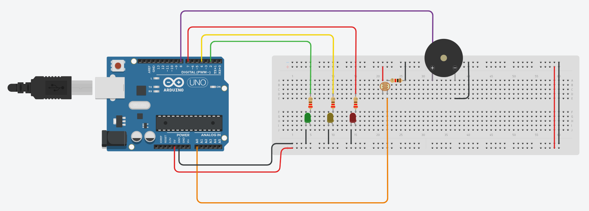

# Checkpoint 01 - O caso da Vinheria Agnello

## Descrição
Esse repositório hospeda os artefatos produzidos durante o processo de construção do Checkpoint 01 referente a matéria de Edge Computing & Computer Systems. Todos os artefatos são cobertos pela licensa [GNU General Public License 3.0](./LICENSE).

## Requisitos do Projeto
Para que seja possível a execução do projeto, são necessários os seguintes requisitos:
- Arduino Uno;
- Um resistor dependente de luz(LDR);
- 3x LED's (1x Vermelho, 1x Amarelo, 1x Verde);
- 3x resistores de 220Ω
- 1x resistor de 1kΩ
- 1x buzzer
- Jumpers para conectar o circuito
- Protoboard

## Construção do Projeto - [Tinkercad](https://www.tinkercad.com/things/bgfKdTfNJtm)

- A implementação do projeto deve seguir o modelo abaixo, com destaque para as seguintes observações:
    - Os resistores conectados aos leds são de 220Ω;
    - Atentar-se ao conectar o pino de saída do LDR. Ele deve ser oriundo da porta de saída desse sensor;
    - Importante que o resistor de 1kΩ seja conectado também na porta de saída do LDR.

## [Vídeo Explicativo](./ProjectExecutingVideo.webm)
